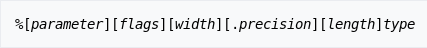
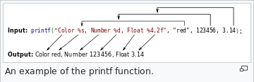
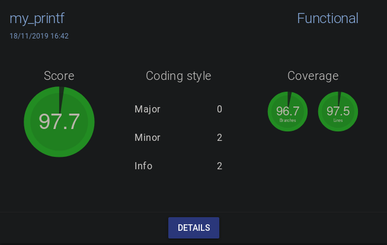

## my_printf
> Unix System Programming
>
> Reproduce the printf function in accordance with the C99 standard
>
> 2 weeks, solo project

- [Usage](#usage)
- [Example](#example)
- [Grade](#grade)

### Usage

_from the [wikipedia page on printf](https://en.wikipedia.org/wiki/Printf_format_string#Syntax)_

See the [man of printf](https://linux.die.net/man/3/printf) for more information

### Example

_from the [wikipedia page on printf](https://en.wikipedia.org/wiki/Printf_format_string)_

### Grade

The coding style violations have been rectified in this repository